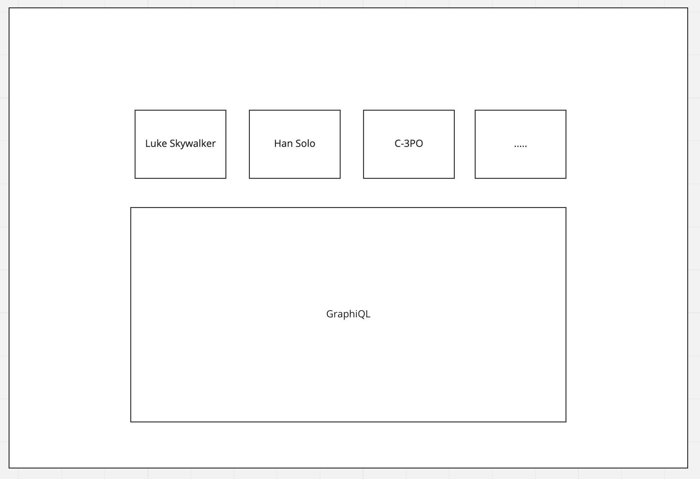

# GraphQL Full-Stack Task

## Purpose
 - See if a code base can be understood and modified
 - See if task descriptions can be understood
 - Find out strengths and weaknesses
 - Try to tackle every task and find out where you struggled and why
 - Be honest to yourself

## Backend
The Backend is written in Go and providing a GraphQL API. It uses following technologies:
 - [gqlgen](https://github.com/99designs/gqlgen)
 - [graphql-go-tools](https://github.com/jensneuse/graphql-go-tools)

Before starting this task, make sure you get a quick overview of GraphQL: https://graphql.org/learn/.

Currently all tests are failing and the goal will be to make them green again. For this, you will need to follow 3 tasks.

> Tests can be run using `go test ./...` command

You can also start the server manually and send queries to the graphql endpoint:

```
go run server.go
curl --location --request POST 'localhost:8085/query' --header 'Content-Type: application/json' --data-raw '{"query":"{ heroes { name } }","variables":{}}
curl --location --request POST 'localhost:8085/query' --header 'Content-Type: application/json' --data-raw '{"query":"{ types }","variables":{}}'
```

### Task 1
**The `heroes` query should return a hard-coded slice of Characters. See the test: https://github.com/pvormste/task-gql-full-stack/blob/main/server_test.go#L20**

Those are the Characters that should be returned by the server:
```
[
    {
        "name": "Luke Skywalker",
        "hasLightsaver": true
    },
    {
        "name": "Han Solo",
        "hasLightsaver": false
    },
    {
        "name": "C-3PO",
        "primaryFunction": "Translator"
    }
]   
```
*Hint:* Look at the gqlgen documentation to find the right place to add the missing code: https://gqlgen.com/getting-started/#implement-the-resolvers

### Task 2
**The `types` query should return only the name of so-called "Object Types" of the GraphQL schema. But there's currently a bug in the code and it is returning also the name of the interface.
   (See the test: https://github.com/pvormste/task-gql-full-stack/blob/main/server_test.go#L29).**

Fix the implementation and make the tests related to this issue pass.

*Hint:* Look inside the `schemaparser` package.

### Task 3 (Bonus)
**For the third task you need to extend the GraphQL schema with 2 enums and their values. See the GraphQL documentation on how to add 
enums to a GraphQL schema: https://graphql.org/learn/schema/#enumeration-types**

The schema can be found in `graph/schema.graphqls`.

First Enum:
 - Episode
   - THE_PHANTOM_MENACE
   - ATTACK_OF_THE_CLONES
   - REVENGE_OF_THE_SITHS
   - A_NEW_HOPE
   - THE_EMPIRE_STRIKES_BACK
   - RETURN_OF_THE_JEDI
   - THE_FORCE_AWAKENS
   - THE_LAST_JEDI
   - THE_RISE_OF_SKYWALKER 


Second Enum:
 - Side
   - JEDI
   - SITH

In the `schemaparser` package there is a function called `CountEnumValues`. The test for it is currently failing. Implement the package so that
the test turns green again.

**How to approach this task:**
 - The `ast.Document` type from graphql-go-tools has `RootNodes` of type `ast.Node` which are being iterated over in the `visitor`. See: https://github.com/jensneuse/graphql-go-tools/blob/master/pkg/ast/ast.go#L12
 - A `ast.Node` has a `NodeKind` and a `ref` (index) to the specific slice of the `NodeKind`. See: https://github.com/jensneuse/graphql-go-tools/blob/master/pkg/ast/ast.go#L31
 - A `EnumTypeDefinition` has a `EnumValuesDefinitionList` See: https://github.com/jensneuse/graphql-go-tools/blob/master/pkg/ast/ast_enum_type_definition.go#L25

> **Info:** Changing the schema only won't change the behavior of the server! But it will be enough to make tests green.

## Frontend

The FrontEnd is written in Javascript and uses following technologies:
 - [React](https://reactjs.org/)
 - [Jest](https://jestjs.io/)

### Task 1 (Make all the tests green).

Currently one of the test is failing one FE, make the changes in the appropriate files to make all the test green.

> Tests can be run using `npm test` command 


### Task 2 (Add UI)

- Use the currently available BE to render a [Graphiql](https://www.npmjs.com/package/graphiql) playground that helps query the graphql API.


- Add UI to render the JSON response received from BE.
- The component should change the the background color on click.
- Cover the functionality with unit tests.

Wireframe :

